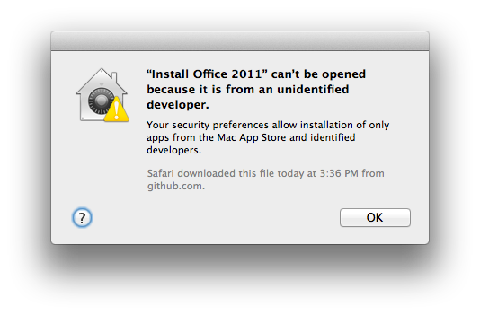
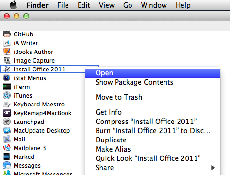
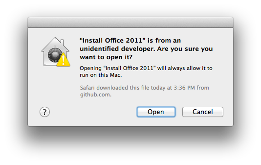
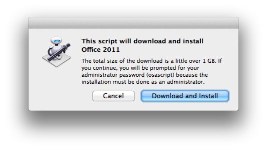
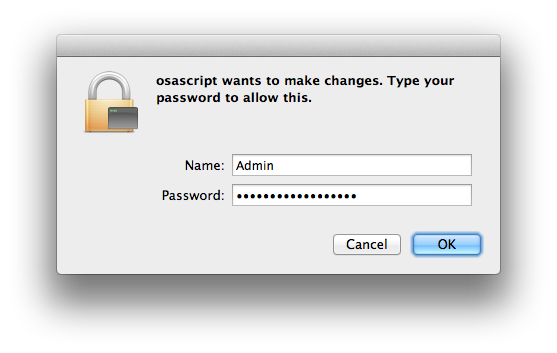

office2011
==========

A shell script to (download, if necessary) and install Office:Mac 2011 and any known updates without any user intervention.

## Before we begin… ##

1. Let me make it clear that this script is not officially endorsed (suggested, recommended, or any such words like that) by Microsoft. In fact I'm fairly sure Microsoft does not even know that I am alive. All trademarks are used solely for identification.
2. This script has been tested with me but comes with absolutely no guarantees. If it works, hurrah! If it breaks, you get to keep both pieces. Anything that happens as a result of you running this will be your responsibility. Not mine, certainly not Microsoft's, etc.
3. This script will not provide you with a free copy of Microsoft Office 2011 for Mac. All it will do is download the necessary pieces (if necessary) and install them. You will still have to add your Product Key to it manually within 30 days of installation.

## What it does ##

The `office2011.sh`  script will look for certain DMG files in a particular folder in your hard drive (by default it will use ~/Downloads/Office2011/ but it will use another folder if you change the `DIR="$HOME/Downloads/Office2011"` line near the top of the script.

Here are the current (as of 2014-04-10) files which it looks for:

* [Microsoft Office 2011 (SP2)](http://www.heidoc.net/joomla/technology-science/microsoft/61-office-2011-for-mac-direct-download-links)
	* [X18-08827.dmg](http://msft.digitalrivercontent.net/mac/X18-08827.dmg)
	* Size (Bytes): 1,036,923,510 (1.03 GB)
	* SHA256: d74534a8af3b88e0b53403eba033d77081b84c4826f0e78ec69094fb3e45d8de

* [Microsoft Office for Mac 2011 14.4.1 Update](http://www.microsoft.com/en-us/download/details.aspx?id=42373)
	* [Office2011-1441Update_EN-US.dmg](http://download.microsoft.com/download/A/6/9/A69FE062-D726-456E-A8AA-B1D2A292300E/Office2011-1441Update_EN-US.dmg)
	* Size (Bytes): 118,984,586 (118.98 MB)
	* SHA256: 340ff8b731c89f103927db4a2571fa81c9fcb0dc683f394919fda12bfc793af7

* [Microsoft Error Reporting for Mac 2.2.9 Update](http://www.microsoft.com/en-us/download/details.aspx?id=35382)
	* [MERP_229.dmg](http://download.microsoft.com/download/B/F/B/BFB8DEB8-91CD-4722-AE6F-476C4013CFFC/MERP_229.dmg)
	* Size (Bytes): 1,600,542 (1.60 MB)
	* SHA256: 221400b62d452fd30865c77a9a67441df6fab77417a9e4ea2084922763da8a1b

* [Microsoft AutoUpdate for Mac 2.3.6 Update](http://www.microsoft.com/en-us/download/details.aspx?id=35381)
	* [AutoUpdate_236.dmg](http://download.microsoft.com/download/B/0/D/B0DB40D2-FF90-4633-925A-B8A7D4183279/AutoUpdate_236.dmg)
	* Size (Bytes): 930,369 (930.36 KB)
	* SHA256: 80d9b48fa89847797e166811b9deb7a0cfaff48a989ac8aa2aaf56bca55c1855

The script is smart enough to check whether minimum requirements are met, and will also check to make sure that it does not install something which has already been installed. It will also checksum the DMGs using `shasum -a 256` to make sure that the files have not been altered or tampered with.

## Intended Usage

Simply put, this script is intended to quickly let you download and install the latest version of Microsoft Office 2011 when setting up a new Mac.

If setting up more than one Mac, simply copy the ~/Downloads/Office2011/ folder from one computer to another after the installation is finished.

## How to break this script ##

1. If you have a version of Microsoft Office installed which is less than 14.2.0 you will need to download and install [Microsoft Office for Mac 2011 Service Pack 2](http://www.microsoft.com/en-us/download/details.aspx?id=29419).

2. There are probably other ways too.

## This script does a basic, standard installation ##

I make a list of all of the files which are created by this script. You can find it at either:

* [all-office-files.mmd][5] for the MultiMarkdown version (3.5 MB)
* [all-office-files.html][6] for the HTML version (3.8 MB)

Note that a few files will differ between installations.

The only known side effect of using this script is that the Microsoft Office apps are not
forcibly inserted into your Dock, as they would be if you used the GUI installer.
This is considered a feature.

## How to do something really stupid

Included in this repository is an ill-conceived shell script named [uninstall_office2011.sh][666] which is a terrible idea and you should not use it.

That would be really stupid. Don't use it. Certainly not without a verified backup. And even then. About the only thing more stupider *(ahem)* than that would be to delete all of your Microsoft related receipt files using something like this:

		sudo rm -fv /private/var/db/receipts/com.microsoft.*

which is a terrible idea because ***you may delete receipts which are not related to Office 2011***. That is an act of stupidity that only the very desperate would take, probably right before they used the `office2011.sh` script to reinstall Office, and only if something had gone terribly wrong and nothing else would fix it. And they had a verified backup. And knew what they were doing. And were willing to accept 100% of the responsibility for the consequences if it didn't work the way they hoped.

Seriously, I'm not kidding. That's just not something that you ever should do.

99.9999% of the time.

I take no responsibility for anything that happens if you decide that *you* are the exception. NONE. Absolutely positively none. Zero. Nada. Zilch.

## Slightly Less Stupid alternative (updated 2013-07-23)
It occurs to me that a *slightly less stupid idea* would be to do:

		sudo mv -vf /private/var/db/receipts/com.microsoft.* ~/Desktop/

which will *move* the files out of the receipts folder onto your Desktop. That way you still have them. After you have reinstalled, you can do this:

		cd ~/Desktop

		sudo mv -vn com.microsoft.* /private/var/db/receipts/

which will move *back* any files which do not exist in /private/var/db/receipts/ so if you *did* happen to move Microsoft-but-not-Office-related receipts, you can restore them.

Any com.microsoft.* files which remain in your ~/Desktop/ would be duplicates, and can (probably) be safely moved to the trash.

### GUI Installer ###

**Update 2013-12-29:** [office2011.sh][11] has been significantly updated, and I have verified that [the Installer](https://github.com/tjluoma/office2011/raw/master/Installer.zip) works on a clean installation which has never had Office installed before.

The installer application is an Automator application and not officially signed, you will see this warning if/when you try to launch it:

Rather than change your security settings, you can simply elect to open the application by selecting it and then control-click (or right-click) to bring up this  contextual menu:

Choose "Open" from those options, and it will confirm yet again:

Once you choose "Open" from the above the menu, the application will run, and you will not have to authorize it again on that computer.

The application will then download the latest version of [office2011.sh][11] to `~/Downloads/office2011.sh` and run it to download and install Office 2011 files, if necessary. The downloads will be saved to **~/Downloads/Office2011/** and that folder can be moved to other Macs (as long as it is put at **~/Downloads/Office2011/**) and the installer can be re-run without having to download the DMGs.

To install the various packages requires your administrator password, but only once per installation. Because the necessary downloads can exceed 1 GB *and* because you will need to enter your administrator password, it will prompt you before it starts to explain:

Finally you will see the usual authentication window asking for your name and password:

Once the script is downloaded and begins to run, a log file will be created in **~/Library/Logs/** (the standard OS X location for log files), and that log file will be opened in the standard **/Applications/Utilities/Console.app** application so that you can watch the installation's progress.

<!-- Reference Links -->

[1]: http://www.heidoc.net/joomla/technology-science/microsoft/61-office-2011-for-mac-direct-download-links

[2]: http://www.microsoft.com/en-us/download/details.aspx?id=35382

[3]: http://www.microsoft.com/en-us/download/details.aspx?id=35381

[4]: http://www.microsoft.com/en-us/download/details.aspx?id=42373

[5]: https://raw.github.com/tjluoma/office2011/master/all-office-files.mmd

[6]: https://raw.github.com/tjluoma/office2011/master/all-office-files.html

[11]: https://github.com/tjluoma/office2011/blob/master/office2011.sh

[666]: https://raw.github.com/tjluoma/office2011/master/uninstall_office2011.sh

[msft.digitalrivercontent.net]: http://msft.digitalrivercontent.net/mac/X18-08827.dmg
